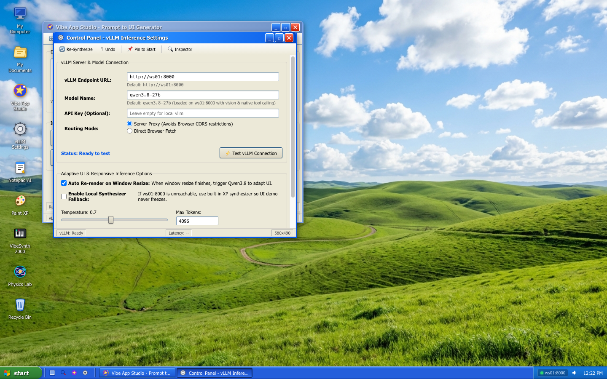
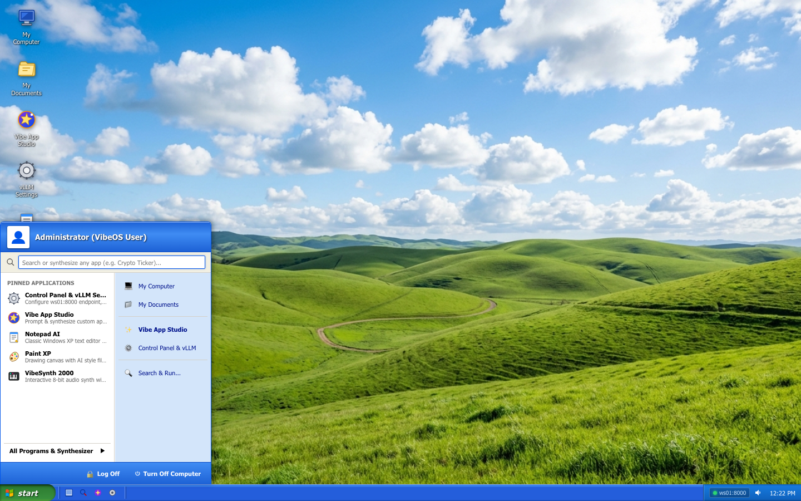
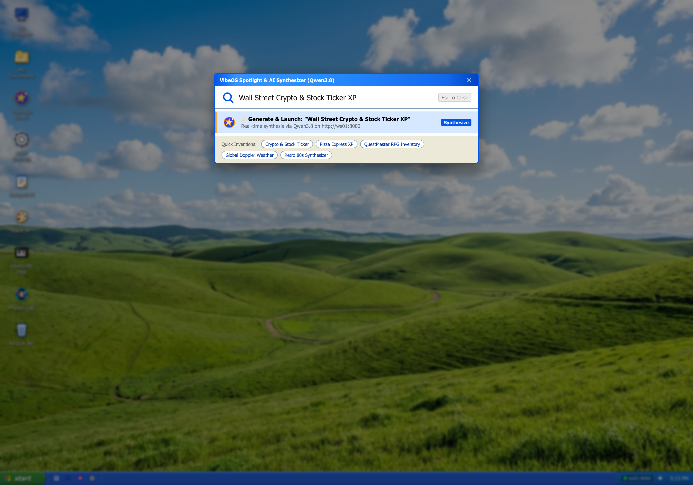
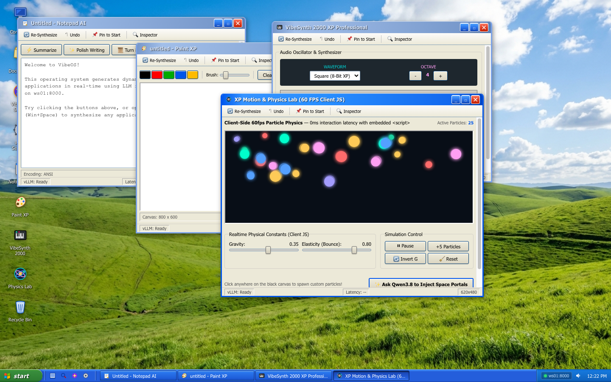
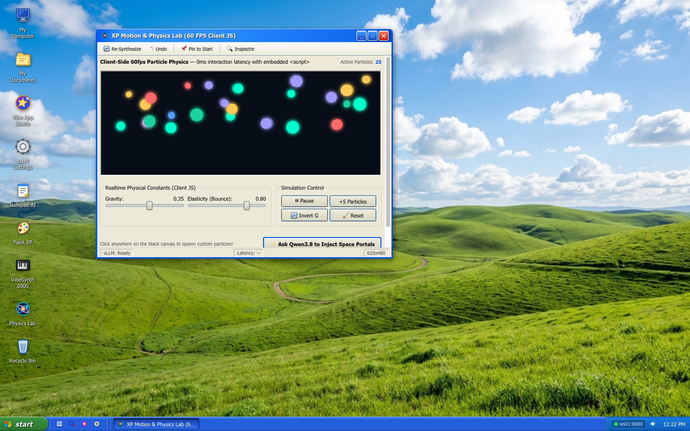

# 🌄 VibeOS — A Generative UI Operating System Demo

<div align="center">


<p align="center">
  <strong>An authentic Windows XP Luna-styled desktop environment powered by realtime LLM application synthesis.</strong><br>
  Prompt any idea into a living, responsive, interactive desktop application in seconds.
</p>

</div>

---

## 🖥️ Desktop Overview



> **VibeOS** is an exploration of **Generative UI** and real-time LLM application synthesis, directly inspired by **Steve Sanderson's**  "VibeOS / Hallucinated Operating System" demonstration. Instead of executing pre-compiled desktop software, VibeOS integrates directly with inference engines (such as local **vLLM** serving **Qwen 3.8**) to hallucinate and synthesize living, interactive, multi-window software on the fly from natural language prompts.

---

## ✨ Key Features

- 🎨 **Authentic Windows XP Luna Shell**:
  - High-fidelity Luna blue titlebars with iconic Minimize, Maximize, and Close buttons.
  - Classic **Bliss** rolling green hills desktop background.
  - Windows XP-style two-column Start Menu with user avatar, search, and pinned applications.
  - Taskbar with pressed states, quick-launch toolbar, active window grouping, system tray clock, and live vLLM status beacon.
- ⚡ **Realtime LLM Application Synthesizer**:
  - Convert any prompt into a functional, styled XP application in real-time.
  - Dual-layer runtime combining LLM semantic intelligence with **0ms zero-latency client-side JavaScript** (Canvas 2D loops, Web Audio API, live sliders, local state).
  - Incremental DOM Patching via `<vibe-patch>` syntax for fast updates without full-window redraws.
  - Adaptive UI auto-reflow when windows are resized.
- 🔍 **Spotlight & PowerToys Runner**:
  - Press `Win + Space` (or `Cmd + Space` / `Ctrl + Space`) from anywhere to launch the Spotlight prompt runner.
  - Search preloaded applications, run prompt syntheses, or pick instant inspiration presets.
- 🛡️ **Offline & LAN Resilient**:
  - Integrated Node.js server proxy eliminates browser CORS hurdles.
  - Built-in local heuristic synthesizer fallback keeps applications interactive even when the remote vLLM GPU worker is offline.

---

## 📸 Visual Tour

### 1. The Iconic Start Menu & Quick Search
Search preloaded apps, trigger AI synthesis, or access system places from the classic two-column Start Menu:



---

### 2. Spotlight AI Synthesizer (`Win + Space`)
Quickly summon the search overlay to prompt new applications, launch existing tools, or pick instant presets:



---

### 3. Preloaded Applications & Creative Suite
VibeOS comes equipped with a comprehensive suite of nostalgic and AI-enhanced software:



| Application | Description | Technology |
| :--- | :--- | :--- |
| **Vibe App Studio** | Prompt-to-UI generator with one-click presets (Wall Street Ticker, Pizza Express, QuestMaster RPG, Doppler Weather). | Qwen 3.8 / vLLM |
| **Notepad AI** | Classic XP text editor with AI writing polish, summarization, ANSI encoding, and code translation. | DOM Forms + LLM Actions |
| **Paint XP** | Full drawing canvas with custom palettes, brush radius sliders, and a Qwen3.8 Art Critic. | HTML5 Canvas 2D |
| **VibeSynth 2000** | 8-bit oscillator synthesizer with waveforms (Square, Sine, Sawtooth), octaves, piano keys, and XP startup chime. | Web Audio API |
| **Control Panel** | Comprehensive vLLM endpoint configuration, model routing, temperature sliders, and live latency testing. | LocalStorage + Health API |

---

### 4. Zero-Latency 60 FPS Physics & Motion Lab
High-performance interactive physics simulation running directly in the browser via client-side JavaScript, featuring dynamic particles, real-time gravity inversion, elasticity sliders, and AI portal augmentation:



---

## 🏗️ Architecture & How It Works

```
                                  +------------------------------------+
                                  |         User Prompt / Action       |
                                  |  (Spotlight, App Studio, Buttons)  |
                                  +-----------------+------------------+
                                                    |
                                                    v
                                  +------------------------------------+
                                  |          WindowManager             |
                                  |  (Creates XP Window, Z-Index, Dim) |
                                  +-----------------+------------------+
                                                    |
                                                    v
                                  +------------------------------------+
                                  |            AppRuntime              |
                                  |  - Gathers Container & Form Values |
                                  |  - Coordinates Event Delegation    |
                                  +-----------------+------------------+
                                                    |
                         +--------------------------+--------------------------+
                         |                                                     |
                         v                                                     v
         +-------------------------------+                     +-------------------------------+
         |    Client JS Engine (0ms)     |                     |        VibeLLMClient          |
         |  - Canvas 2D Animations       |                     |  - Formulates System Prompt   |
         |  - Web Audio Oscillators      |                     |  - Targets LLM API (vLLM)     |
         |  - Local Sliders & Toggles    |                     |  - SSE Streaming & Fallback   |
         +-------------------------------+                     +---------------+---------------+
                                                                               |
                                                                               v
                                                               +-------------------------------+
                                                               |     Node.js Server Proxy      |
                                                               |   /api/llm/generate & /health |
                                                               +---------------+---------------+
                                                                               |
                                                                               v
                                                               +-------------------------------+
                                                               |   OpenAI compatible Endpoint  |
                                                               |     (vLLM/Qwen 3.8)           |
                                                               +-------------------------------+
```

### Dynamic DOM Patching (`<vibe-patch>`)
When an application receives an event, the LLM can either output a full UI redesign or emit targeted patches to keep state fluid:
```html
<vibe-patch selector="#order-book" mode="replace">
  <div class="bid-row">BTC: $68,450.00 (+2.4%)</div>
</vibe-patch>
```
Supported modes: `replace`, `append`, `prepend`, `text`, `style`, and `attr`.

### Memory & Animation Sandboxing
To avoid performance degradation across multiple open/closed windows, VibeOS wraps `setInterval`, `clearInterval`, `requestAnimationFrame`, and `cancelAnimationFrame` inside window lifecycle registries. When a window is closed, all associated timers, audio contexts, and DOM listeners are automatically garbage-collected.

---

## 🚀 Quick Start

### 1. Prerequisites
- **Node.js**: v18.0.0 or higher
- Modern web browser (Chrome, Chromium, Edge, Safari, Firefox)

### 2. Clone & Run
```bash
# Clone the repository
git clone https://github.com/Jellepepe/vibeOS.git
cd vibeOS

# Start the server (vanilla Node.js, zero external npm dependencies required!)
node server.js
```

Open your browser to:
```
http://localhost:3000
```

### 3. URL Presentation & Screenshot Modes
VibeOS supports deterministic layout testing via URL parameters:
- `http://localhost:3000/?view=start` — Desktop with the Start Menu open.
- `http://localhost:3000/?view=spotlight` — Desktop with the Spotlight search runner active.
- `http://localhost:3000/?view=apps` — Desktop with the Creative Suite open (Notepad, Paint, Synth, Physics).
- `http://localhost:3000/?view=physics` — Fullscreen view of the 60 FPS Motion & Physics Lab.
- `http://localhost:3000/?view=studio` — Dedicated view of the Vibe App Studio generator.
- `http://localhost:3000/?view=settings` — Control Panel and vLLM configuration.

---

## ⚙️ Connecting Your Own vLLM Server

By default, VibeOS routes requests to `http://localhost:8000` with model `qwen3.8-27b`. You can connect any OpenAI-compatible server (e.g., vLLM, Ollama, LM Studio, or local API gateways):

1. Open **Control Panel** in VibeOS (via Start Menu or System Tray badge).
2. Set your endpoint (e.g., `http://localhost:8000`) and model name.
3. Click **Test vLLM Connection**.
4. Save settings — the system tray badge will immediately switch to green indicating an active link.

---

## ⌨️ Keyboard Shortcuts

| Shortcut | Action |
| :--- | :--- |
| `Win + Space` / `Cmd + Space` | Open Spotlight Search & App Synthesizer |
| `Escape` | Close active modal, Start Menu, or Spotlight |
| `Enter` (in Start Menu search) | Launch synthesized app from search input |
| `Arrow Up` / `Arrow Down` | Navigate Spotlight search results |

---

## 📁 Repository Structure

```
vibeOS/
├── assets/
│   ├── bliss.jpg                    # High-resolution original Windows XP Bliss wallpaper
│   └── screenshots/                 # High-resolution application screenshots
│       ├── vibeos_desktop.png       # Complete desktop with Studio & Control Panel
│       ├── vibeos_start_menu.png    # Windows XP Start Menu open
│       ├── vibeos_spotlight.png     # Spotlight AI search runner
│       ├── vibeos_creative_suite.png# Notepad, Paint, Synth & Physics open together
│       └── vibeos_physics_lab.png   # 60 FPS Particle Physics Lab
├── css/
│   ├── xp-base.css                  # Colors, fonts, resets, system cursors
│   ├── xp-desktop.css               # Desktop layout, icon grids, rubberband selection
│   ├── xp-taskbar.css               # Luna green start button, task buttons, tray clock
│   ├── xp-startmenu.css             # Authentic two-column Start Menu
│   ├── xp-spotlight.css             # Spotlight search runner modal
│   ├── xp-window.css                # Window chrome, active/inactive headers, resizing
│   └── xp-uikit.css                 # XP buttons, tabs, groupboxes, listviews, sliders
├── js/
│   ├── apps/
│   │   └── preloaded-apps.js        # Built-in apps (Studio, Notepad, Paint, Synth, Physics)
│   ├── app-runtime.js               # Dynamic DOM rendering, patching, script execution
│   ├── config.js                    # System settings, prompt templates, defaults
│   ├── icons.js                     # Scalable SVG Windows XP iconography
│   ├── llm-client.js                # vLLM client, SSE streaming, action dispatch
│   ├── main.js                      # Bootstrap, clock, icon binding, URL routing
│   ├── spotlight.js                 # Spotlight runner modal and shortcuts
│   ├── start-menu.js                # Start Menu toggle, pinning, search filtering
│   └── window-manager.js            # Window drag, resize, z-index, minimize/maximize
├── index.html                       # Main desktop container & shell HTML
├── server.js                        # Node.js static server & vLLM CORS proxy
├── LICENSE                          # BSD 3-Clause License
└── README.md                        # Documentation & visual showcase
```

---

## 🤝 Contributing

Contributions are warmly welcomed! This was a simple demo project to play around with purely generative interfaces, but feel free to mess with it.

---

## 💡 Acknowledgements & Prior Art

This project is directly inspired by and builds upon the concepts from **Steve Sanderson's** demonstration of **VibeOS** — an exploration of agentic, hallucinated operating systems where user interfaces and application behaviors are generated on the fly by an LLM in response to user intent and interaction.

---

## 📄 License

This project is licensed under the **BSD 3-Clause License** — see the [LICENSE](LICENSE) file for complete details. Windows XP and associated Luna design elements are trademarks or registered trademarks of Microsoft Corporation. This project is an artistic and technical simulation built for demonstration and research purposes.
